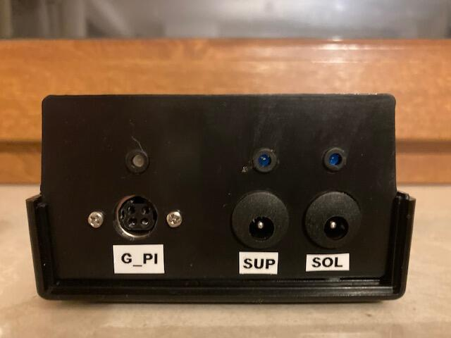
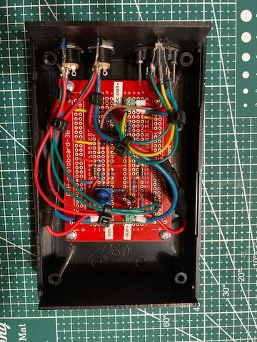

**
Solar - DC Power Backup Module
**

Solar - DC Power Backup Module is an accessory for gardenpi controller allowing the device to be powered from dc power supply in situations when battery storing solar energy is insufficiently charged. Design has been based on LM358 operation amplifier configured as analog signal comparator.

**Key Features:**

- It is possible to connect 12V DC external power supply using socket marked as SUP
- It is possible to connect  12V DC input from solar panel voltage regulator using socket marked as SOL
- Whenever input voltage is present on SOL or SUP inputs, blue LED is switched-on above respective socket
- If solar panel voltage regulator detects that battery output voltage is 11.1V or less then output voltage from the regulator is set to 0V on SOL input until battery is charged again to 12.5V.
- If voltage at SOL input is 0V then voltage from SUP input is directed to output marked as G_PI
- When G_PI voltage is routed from SOL input then LED above G_PI socket turns green.
- When G_PI voltage is routed from SUP input then LED above G_PI socket turns red.
- Device connected to G_PI (garden pi controller) is provided with power as long as nominal voltage on either SOL or SUP inputs is present. 
- Voltage from SOL input is always routed to G_PI output with higher priority then from SUP input.

**Design and Build Instructions**

HW design has been described in the following files:

* [Bill of Materials](./docs/hw_bom.txt)
* [Circuit diagram](./docs/solar_dc_power_backup_schematics.pdf)
* [HW Photos](./hw/)

This is hardware only project. No software is developed as part of Solar - DC Power Backup Module. Digital signal indicating source of DC voltage is however available on one of the G_PI socket pins.

**Initial Configuration**

* Not Applicable

**Device Operation**

Device does not require special maintenance, if GardenPi operates from location where there is no wifi access its RTC can drift so it is desirable to bring it within wifi coverage from time to time. Such behavior can be expected, but was not observed in real life yet.

**Release History**

* Release 1.0 - November 2022 - final version of the device released, no more updated are planned.
	
**Planned Functionality**

* Not Applicable

Comments or Questions can be directed to: andrzej@mazur.info
